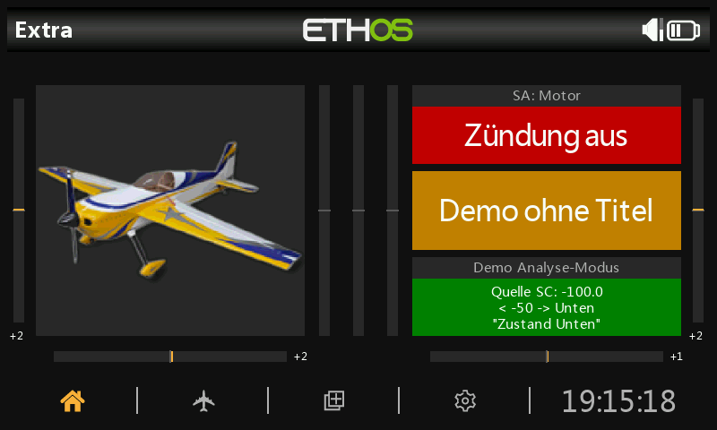
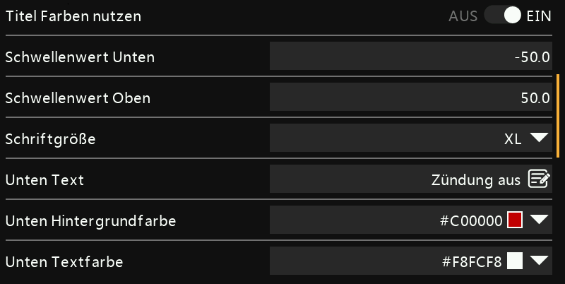
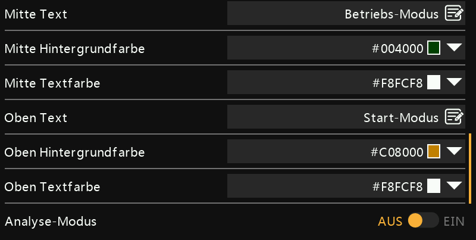
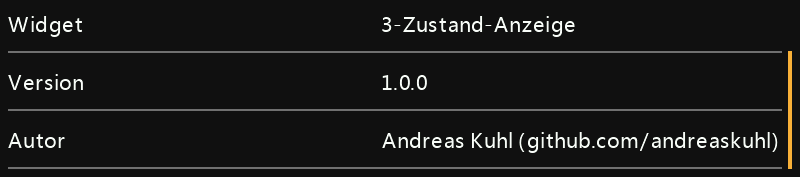

## 🌐 Other Languages |  Andere Sprachen 
- [German | Deutsch](readme.de.md)
  
ℹ️ The English version is AI-translated from the German version readme.de.md.
***

<h1 name="top"> 3STATED | 3-State Indicator </h1>
Widget for textual and color display of 3 states of a source (switch, variable, ...).  
Version 1.1.0

|                  |                                                     |
| ---------------- | --------------------------------------------------- |
| Development Env. | Ethos X20S Simulator 1.6.3                          |
| Test Env.        | FrSky Tandem X20, Ethos 1.6.3 EU, Bootloader 1.4.15 |
| Author           | Andreas Kuhl (https://github.com/andreaskuhl)       |
| License          | GPL 3.0                                             |

If you like it you can support it by making a donation!

  

- [Functionality](#functionality)
- [Ideas for Further Features](#ideas-for-further-features)
- [Installation](#installation)
- [Acknowledgements](#acknowledgements)
- [Images](#images)
- [Release Information](#release-information)

# Functionality
  - **3 states** (status) definable
    - Down -> usually negative values
    - Middle -> usually zero
    - Up  -> usually positive values
  - **State source freely selectable** (switch, variable, ...).
  - For each state, **text, background color, and text color selectable**.
  - **Thresholds** (TH) freely definable
      - Default: TH-Down = -50, TH-Up = +50
      - Evaluation rule:
        1. less than TH-Down --> state "Down"
        2. greater/equal TH-Down and less than TH-Up -> state "Middle"
        3. otherwise (greater than TH-Up) -> state "Up"
      - If TH-Down is set equal to TH-Up, only "Down" and "Up" states are possible
        ("Middle" is not reachable).  
      Note: Different source types have different value ranges (switch -100 to 100,
                 rotary knob -1024 to 1024, ...). Therefore, different threshold values make sense.
  - **Show title and source** (each switchable), in small above the state text. The title area can optionally be displayed in the state colors or with separately defined colors for background and text.
  - **Multiline state text**. Simply insert "\_b" (for "line break") as a line separator within the respective state text. Any number of lines is possible and only limited by the widget and font size.
  - **Efficient widget update** only on actual state change, not on every change of the state source.
  - **Analysis mode** (switchable): Output of source, value, and state text. Useful for testing and determining suitable threshold values.
  - **Localization**: German (de), English (en), French (fr), Spanish (es), Italian (it), and Czech (cz)

# Ideas for Further Features
  - **Template mechanism** to easily load different widget configurations into a model.  
  Useful since the configuration has become quite extensive and the same state display is needed in many models - e.g. tow release open/closed, motor emergency stop active/inactive, flap position thermal/normal/speed, ...
  - **5 states**, instead of 3 also 5 states - e.g. for analog controllers -> Is this needed?
  - Further localization -> If needed, please report ... or even better, provide a translation.
  
  Please report if there is a need for this or other features.  
  => Create an issue on GitHub, of course also for bugs!
  
# Installation
Download the 3stated_x_x_x.zip from the current GitHub release and copy the "3stated" folder from it into the "scripts" folder of the X20 SD card.
At the next transmitter start, the widget should be selectable.
For more details on LUA widget script installation, simply search the internet. This has already been described many times.  

# Acknowledgements
Many thanks for the following helpful examples:
  - Switch display (V1.4 from 28.12.2024), JecoBerlin
  - Ethos-Status-widget / Ethos-TriStatus-widget (V2.1 from 30.07.2025), Lothar Thole (https://github.com/lthole)

# Images
Example state displays:

Widget configuration:

# Release Information

| Version |    Date    | Modification                                                                                                                                                                                   |
| ------: | :--------: | ---------------------------------------------------------------------------------------------------------------------------------------------------------------------------------------------- |
|   1.1.0 | #.09.09.20 | New feature: Multiline state text.                                                                                                                                                             |
|   1.0.2 | 02.09.2025 | Implementation of user data version number for identification and conversion of older user data from previous widget versions. Internal extension for future use - no update needed for users. |
|   1.0.1 | 31.08.2025 | Readme update: Adjusted installation description. No standalone release package.                                                                                                               |
|   1.0.0 | 31.08.2025 | First official release.                                                                                                                                                                        |

[↑ Back to top](#top)
