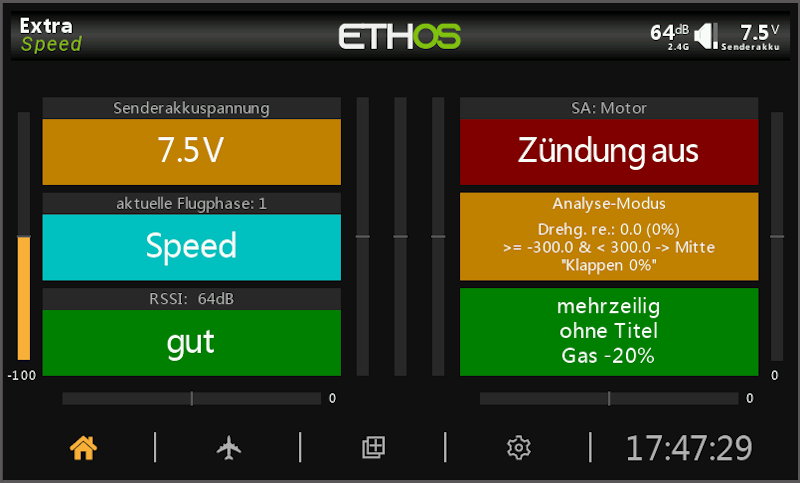

## 🌐 Other Languages |  Andere Sprachen 
- [German | Deutsch](readme.de.md)
  
ℹ️ The English version is AI-translated from the German version readme.de.md.
***

<h1 name="top"> 3STATED | 3-State Display </h1>

Widget for textual and colored display of 3 states from a source (switch, variables, ...).  
Version 2.0.0

|                  |                                                     |
| ---------------- | --------------------------------------------------- |
| Development Env. | Ethos X20S Simulator 1.6.3                          |
| Test Env.        | FrSky Tandem X20, Ethos 1.6.3 EU, Bootloader 1.4.15 |
| Author           | Andreas Kuhl (https://github.com/andreaskuhl)       |
| License          | GPL 3.0                                             |

If you like it you can support it by making a donation!

  

- [Functionality](#functionality)
- [Ideas for Additional Features](#ideas-for-additional-features)
- [Installation](#installation)
- [Acknowledgments](#acknowledgments)
- [Images](#images)
- [Release Information](#release-information)

# Functionality
  - **3 States** definable
    - Down -> typically negative values
    - Middle -> typically zero
    - Up -> typically positive values
  - **State source freely selectable** (switches, variables, system, telemetry, ...)
  - For each state, **text, background color, and text color are selectable**
  - **Threshold values** (TV) freely definable
      - Default values: TV-Down = -50, TV-Up = +50
      - Evaluation rules:
        1. less than TV-Down --> State "Down"
        2. greater than/equal to TV-Down and less than TV-Up -> State "Middle"
        3. otherwise (greater than TV-Up) -> State "Up"
      - When TV-Down equals TV-Up, the possible states are reduced to "Down" and "Up"
        ("Middle" is not reachable).  
      Note: The different source types also have different value ranges (switches -100 to 100,
                rotary encoders -1024 to 1024, ...). This results in correspondingly different meaningful
                threshold values.
  - **Display title and source** (each switchable), in small text above the state text. The title area can optionally be displayed in the state colors or with separately defined colors for background and text.
  - **Multi-line state text**. Simply insert "\_b" (for "line break") as line separator in the respective state text. Any number of lines is possible but limited by text length, widget, and font size.  
  - **Source/Value display**. Simply enter the following placeholders in the respective state text:
    - Name of the source (name): "_n"
    - Text of the source value (text): "_t"
    - Numeric source value (value): "_v"
    - "... rounded to \<N\> decimal places: "\_\<N\>v"
    - Special character _: "__"  
    Example: "_n: _t (_1v)" results in "Rx.Bat: 5.27V (5.3)"  
    This works with all types of sources, including flight phases, switches, telemetry, and system values.

  - **Analysis mode** (switchable): Output of source, value, and state text. Useful for testing and determining appropriate threshold values.
  - **Localization**: German (de), English (en), French (fr), Spanish (es), Italian (it), and Czech (cs)

# Ideas for Additional Features
  - **Template mechanism** to easily load different configurations of the widget into a model.  
  This makes sense since the configuration has become quite extensive and the same state display is needed in many models - e.g., tow coupling open/closed, motor emergency stop active/inactive, flap position thermal/normal/speed, ...
  - **5 States**, instead of 3 also 5 states - e.g., for analog controllers -> Is this needed?
  - Further localization -> Just let us know if needed ... or even better, provide a translation.
  
  Please let us know if there is a need for these or other features.  
  => Create an issue on GitHub, of course also for bugs!
  
# Installation
Download the 3stated\_x\_x\_x.zip from the current GitHub release and copy the "3stated" directory from it to the "scripts" directory of the X20 SD card.
The widget should be selectable at the next transmitter start.
For more details on LUA widget script installation, simply search the internet. This has been described many times.  

# Acknowledgments
Many thanks for the following helpful examples:
  - Switch display (V1.4 from 28.12.2024), JecoBerlin
  - Ethos-Status-widget / Ethos-TriStatus-widget (V2.1 from 30.07.2025), Lothar Thole (https://github.com/lthole)

# Images
Example state displays:

# Release Information

| Version |   Date     | Changes                                                                                                                                                                                                                              |
| ------: | :--------: | ------------------------------------------------------------------------------------------------------------------------------------------------------------------------------------------------------------------------------------ |
|   2.0.0 | 19.10.2025 | New features: Value display in state text or title (numeric or textual source value), restructuring of widget configuration, "Show source" replaced by placeholder "_n" and code improvement                                            |
|   1.1.0 | 09.09.2025 | New feature: Multi-line state text                                                                                                                                                                                                   |
|   1.0.2 | 02.09.2025 | Implementation of user data version number for identification and conversion of older user data from older widget versions. Internal extension for future use - no update necessary from user perspective.                              |
|   1.0.1 | 31.08.2025 | Update Readme: Adjusted installation description. No standalone release package.                                                                                                                                                       |
|   1.0.0 | 31.08.2025 | First official release.                                                                                                                                                                                                              |

[↑ Back to top](#top)
